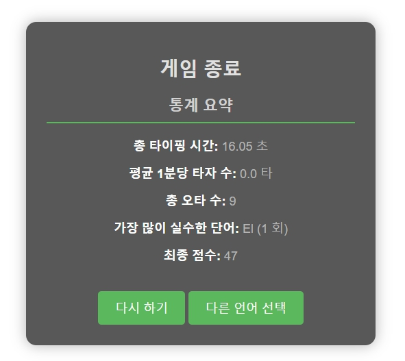
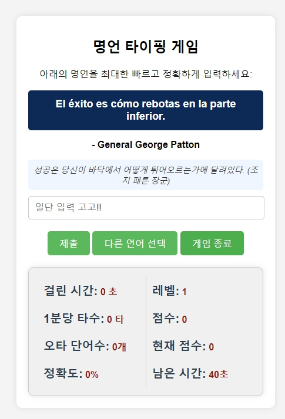

# 언어별로 즐기는 명언 타자 연습 게임

  
## 소개

이 프로젝트는 다양한 언어로 된 명언을 빠르고 정확하게 타이핑하는 게임입니다. 사용자는 주어진 시간을 기반으로 명언을 입력하며, 결과에 따라 정확도, 1분당 타수(CPM), 오타 개수 및 점수가 계산됩니다.
  

 

  
## 기능

- 다양한 언어로 명언 제공 (한국어, 영어, 스페인어, 프랑스어, 독일어, 라틴어)
- 입력한 내용을 기반으로 점수, 정확도, 1분당 타수(CPM) 및 오타 수를 계산
- 각 라운드마다 남은 시간 보너스 및 정확도 보너스 점수 제공
- 40초 타이머 내에 명언을 최대한 정확하게 입력하는 방식
- 레벨별 난이도 제공 (최대 10 레벨)
- 게임 종료 후 통계 요약 제공

## 폴더구조
  
```plaintext
📁 ENG_TYPING_GAME
├── 📁 logo
│   └── 🖼️ game_01.jpg
├── 📁 static
│   ├── 📁 css
│   │   ├── 📝 choose_language.css
│   │   ├── 📝 game_over.css
│   │   ├── 📝 index.css
│   │   └── 📝 loading_modal.css
│   ├── 📁 js
│   │   ├── 📄 index.js
│   │   └── 📄 loading_modal.js
├── 📁 templates
│   ├── 📝 choose_language.html
│   ├── 📝 game_over.html
│   └── 📝 index.html
├── 📄 quotes.json
├── 📄 README.md
└── 📄 velocity.py
```
  
## 설치 및 실행 방법
  
   ```bash
   python velocity.py

  
